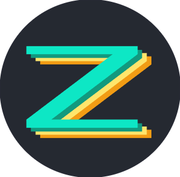

  
   
   
  

**Zedromeda** theme aims to be as close as possible to the original Zed Editor Andromeda theme.

This theme has primarily been tested with the following languages:
  - Rust
  - TypeScript/JavaScript
  - C#

And the following frameworks:
  - Vue

> Note: this theme prioritizes textmate scopes over token types for more accurate theme coloring. This may result in inaccurate colors for languages/frameworks I have not tested.

If you would like me to update colors for a specific language/framework please open an [issue](https://github.com/TomMalitz/cooper/issues) with the relavant details, thanks!
